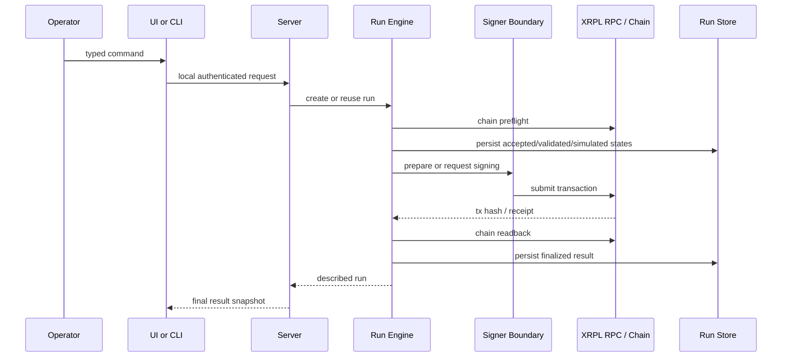
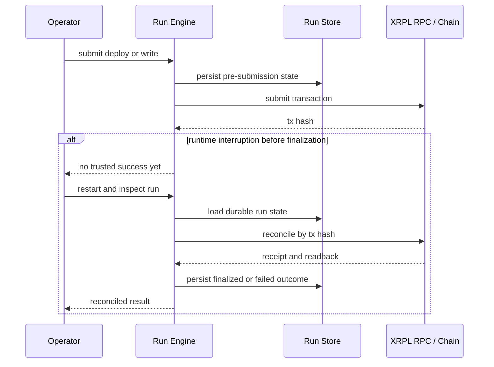

# Architecture

ForgeX has one active execution architecture. This document is the technical source of truth for how authority, data flow, and persistence work.

## Component Map

| Component | Responsibility | Trust role |
| --- | --- | --- |
| UI / CLI | Collect local operator commands and render results | Untrusted input surface |
| `backend/server.js` | Local-only HTTP surface, session bootstrap, route gating | Orchestration boundary |
| `backend/run-engine.js` | Validation, idempotency, chain preflight, run lifecycle | Orchestration boundary |
| `backend/signer.js` | External-signer envelopes and dev signer fallback | Signer boundary adapter |
| `backend/run-store.js` | Durable run/deployment records | Evidence and recovery state, not canonical chain truth |
| `backend/runtime.js` | Readiness, runtime status, observability | Operational visibility only |
| `contracts/*` | On-chain authorization and mutation rules | Canonical contract logic |
| XRPL RPC / chain | Receipt and state source | Canonical chain source |

## Trust Boundaries

- Operator authority starts outside the backend.
- Sensitive HTTP routes require loopback access and a local operator session.
- External signer is the default boundary for deploy/write authorization.
- Receipts and readbacks outrank all local persistence.
- The run store is durable, but not canonical over the chain.

## Run Lifecycle

Runs move through `accepted -> validated -> simulated -> prepared/submitted -> finalized/failed`.

## Failure / Recovery Sequence

## Signer Boundary

| Mode | Submission path | Canonical proof path |
| --- | --- | --- |
| `external` | Backend prepares command, operator signs externally | tx hash -> receipt -> readback |
| `dev-private-key` | Backend signs locally only when explicitly enabled | tx hash -> receipt -> readback |
| `test` | Test harness only | Never sponsor-grade proof |

## Storage Truth Rules

| Storage layer | What it stores | Canonical? |
| --- | --- | --- |
| Chain receipt | Deploy/write outcome | Yes |
| Chain readback | Final displayed contract state | Yes |
| Run store | Run lifecycle and deployment records | No |
| UI state JSON | Window/background preferences | No |
| `.env` | Boot configuration | No |

`backend/run-store.js` is SQLite-first and falls back to a durable JSON-backed store when `node:sqlite` is unavailable. Neither mode changes chain truth rules.

## Route / Auth Map

All routes are behind loopback-only request enforcement. Sensitive routes also require the local operator session token.

| Route | Auth | Mutates chain | Purpose |
| --- | --- | --- | --- |
| `/api/session` | Local-only | No | Bootstrap local operator session |
| `/ai` | Session | Indirect via typed commands | NDJSON command stream |
| `/api/command` | Session | Indirect via typed commands | Static fallback execution path |
| `/runs/deploy-message-vault` | Session | Yes | Typed deploy entrypoint |
| `/runs/set-message` | Session | Yes | Typed write entrypoint |
| `/runs/get-message` | Session | No | Typed read entrypoint |
| `/runs/:forgeRunId` | Session | No | Run inspection |
| `/deployments` | Session | No | Deployment listing |
| `/deployments/:deploymentId` | Session | No | Deployment detail |
| `/events` | Session | No | SSE runtime snapshots |
| `/api/runtime-status` | Session | No | Runtime health/readiness |
| `/state/ui` | Session | No | Sanitized UI-state persistence |
| `/api/health` | Session | No | Health response |

## Local-First Assumptions

- ForgeX is designed for one operator on one machine.
- Browser and CLI are both local clients of the same local runtime.
- This architecture does not assume a shared-hosting or multi-user threat model.

## Blast Radius Boundaries

- Remote attack surface is limited by loopback-only posture.
- Contract mutation surface is limited to typed deploy/write actions in the active runtime.
- Dev signer risk exists only when intentionally enabled.
- Residual blast radius remains the local machine, configured signer, and configured XRPL RPC.
