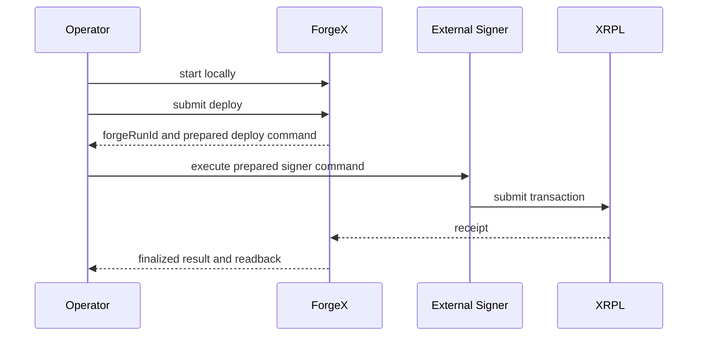

# Demo Script

Do not use this script as sponsor proof until the relevant release-gate items in [PROOF-OF-CORRECTNESS.md](./PROOF-OF-CORRECTNESS.md) are green.

## Demo Flow

## Setup

1. Start ForgeX locally.
2. Open the app on `http://127.0.0.1:3000`.
3. Confirm the startup log shows:
   - local bind
   - signer mode
   - no sponsor-invalid test mode
4. Have the proof docs open:
   - `SECURITY-MODEL.md`
   - `PROOF-OF-CORRECTNESS.md`
   - `XRPL-READINESS.md`

## Happy Path

### Step 1: Show local-only posture
- Action: show the runtime is bound to `127.0.0.1`.
- Proves: ForgeX is not presenting a public relay surface.
- Say: "This runtime only accepts local requests in secure mode."

### Step 2: Show local operator session
- Action: show `/api/session` or the successful UI bootstrap.
- Proves: sensitive actions require a local operator session.
- Say: "The browser is not trusted by default; it must obtain a local operator session first."

### Step 3: Show signer boundary
- Action: show startup logs or session payload with `signerMode: external`.
- Proves: backend is not the normal signing authority.
- Say: "External signer is the default path. The backend prepares runs but does not own default signing authority."

### Step 4: Trigger a deploy run
- Action: submit `deploy contract`.
- Proves: typed run flow and `forgeRunId` tracking.
- Show:
  - `forgeRunId`
  - prepared signer command
- `prepared`
- Say: "Prepared does not mean successful. ForgeX has not declared success here."

### Step 5: Execute signer step and show reconciliation
- Action: execute the prepared signer command locally.
- Proves: explicit signer boundary, tx hash capture, receipt confirmation, contract-address derivation.
- Show:
  - `txHash`
  - receipt confirmation
  - final contract address

### Step 6: Trigger a write run
- Action: submit `set value <message>`.
- Proves: constrained target/action and post-confirmation readback.
- Show:
  - `forgeRunId`
  - `txHash`
  - readback result
- Say: "The displayed value comes from chain readback, not optimistic client state."

## Hostile / Failure Path

Only run a hostile-path step live if its release-gate item is green. Otherwise, show the proof document and mark it pending.

### Step 7: Duplicate or replay-like attempt
- Action: show duplicate idempotency handling or replay proof.
- Proves: duplicate execution or replay is contained.

### Step 8: Wrong-network scenario
- Action: show the pre-submission rejection path.
- Proves: ForgeX fails before write submission on the wrong chain.

### Step 9: Stream-failure fallback
- Action: show or describe the fallback from `/ai` streaming to `/api/command`.
- Proves: operator is not stranded by transport failure.

### Step 10: Crash/recovery narrative
- Action: explain how tx-hash reconciliation outranks partial UI memory.
- Proves: ForgeX does not invent success from partial local state.

## Artifacts To Show At The End

- [PROOF-OF-CORRECTNESS.md](./PROOF-OF-CORRECTNESS.md)
- [SECURITY-MODEL.md](./SECURITY-MODEL.md)
- [XRPL-READINESS.md](./XRPL-READINESS.md)
- latest `npm run audit:system` result
- latest Foundry pass captured in [FOUNDRY-VERIFICATION.md](./FOUNDRY-VERIFICATION.md)

## Failure Handling Narrative

Use this line if a step is pending proof:

"This behavior is implemented, but it is not claimed as verified sponsor proof until the corresponding release-gate item is captured."
