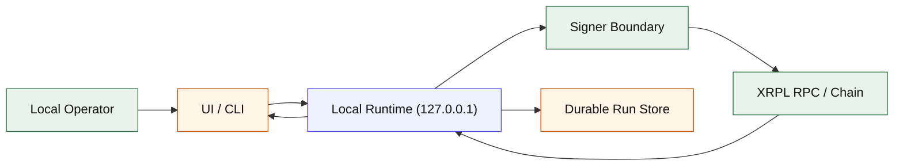
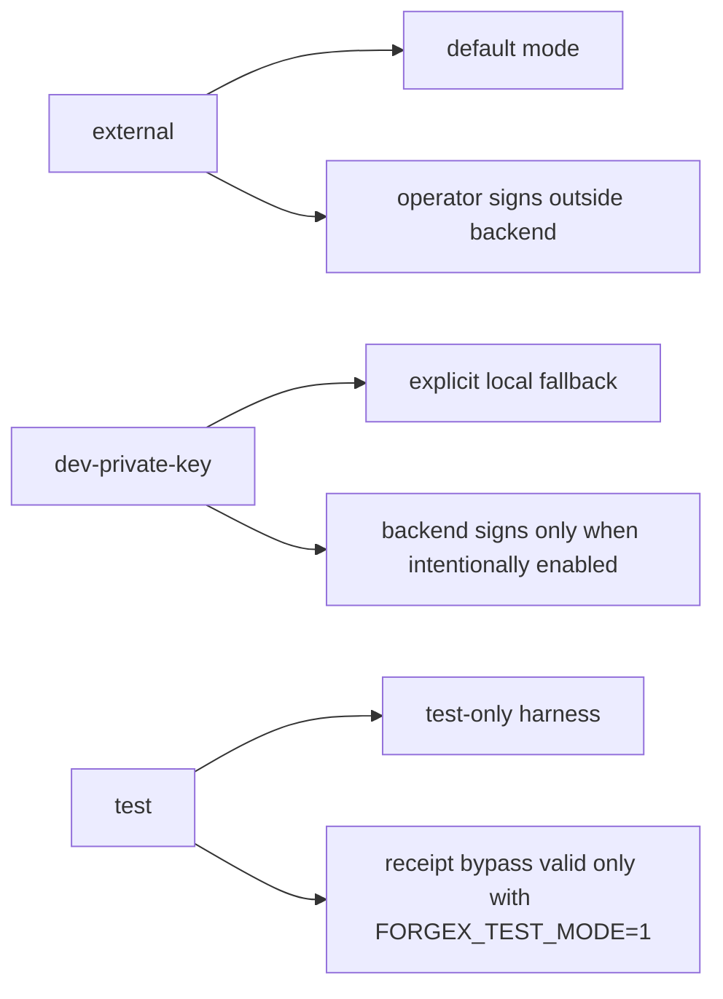

# Security Model

ForgeX has one active trust model:
- loopback-only runtime
- authenticated local operator session
- external-signer-first execution
- typed runs identified by `forgeRunId`
- confirmed receipts and post-confirmation readbacks as canonical truth

## Trusted vs Untrusted

| Category | Trusted | Notes |
| --- | --- | --- |
| Local operator | Yes | The operator is the intended authority on the same machine. |
| External signer | Yes in normal mode | This is the default signing boundary. |
| Backend runtime | Conditionally | Trusted to validate, orchestrate, and persist run state, but not as the normal signing root. |
| Confirmed receipt data | Yes | Canonical for deploy/write outcome. |
| Post-confirmation chain readback | Yes | Canonical for final displayed contract state. |
| Browser input | No | Treated as untrusted input even on localhost. |
| UI state files | No | Convenience state only. |
| Run-store records | No for final truth | Durable evidence and orchestration state, not canonical chain truth. |
| `.env` during runtime | No for chain truth | Boot/config only. |
| Prior run history | No | Helpful for recovery, never authoritative over chain receipt/readback. |

## Trust Boundary

## Signer Boundary

| Mode | Default | Who signs | Backend role | Sponsor-grade |
| --- | --- | --- | --- | --- |
| `external` | Yes | Operator outside the backend | Prepare command, track run, confirm receipt | Yes |
| `dev-private-key` | No | Backend via explicit local private key | Lower-trust local fallback | No |
| `test` | No | Test-only harness | Allows receipt bypass only with `FORGEX_TEST_MODE=1` | No |

Rules:
- `FORGEX_SIGNER_MODE` defaults to `external`.
- `FORGEX_ALLOW_DEV_SIGNER=1` is required for intentional local dev signing.
- `FORGEX_DEV_ASSUME_RECEIPT=1` has no effect unless `FORGEX_TEST_MODE=1`.
- Backend signing is available only as an explicitly lower-trust exception, not as the normal authority boundary.

## What Success Means

Deploy/write success means all of the following are true in a non-test path:
1. The run is accepted and validated.
2. Chain preflight passes the expected XRPL chain ID.
3. A transaction hash exists for the submitted action.
4. A confirmed receipt is returned before the confirmation timeout expires.
5. The final result is reconciled from chain data.
6. For writes, the displayed state is based on post-confirmation chain readback.

`prepared` is not success. It is a prepared external-signer state.

## Chain Truth Rules

| Data | Canonical source | Not trusted as canonical |
| --- | --- | --- |
| Contract address | Confirmed receipt plus saved deployment record | `.env`, latest artifact, UI cache |
| Write final state | Post-confirmation chain readback | Optimistic UI updates, prior run memory |
| Run completion | Receipt confirmation and final reconciliation | Client-supplied status |
| Network identity | `eth_chainId` against configured XRPL chain ID | Caller-provided RPC claims |

## Run Lifecycle

Runs move through these states:
- `accepted`
- `validated`
- `simulated`
- `prepared` or `submitted`
- `finalized` or `failed`

Each run persists:
- `forgeRunId`
- immutable request envelope
- idempotency key
- target action
- signer mode
- optional `txHash`
- result snapshot

The run store is durable execution state. It is not canonical over the chain.

## Backend Can And Cannot Do

| Backend can | Backend cannot |
| --- | --- |
| Enforce local-only access | Act as the default sponsor-grade signer |
| Issue an authenticated local operator session | Accept arbitrary contract addresses or arbitrary ABI write calls in the active runtime |
| Validate typed commands and payloads | Declare success before receipt confirmation in non-test paths |
| Run Foundry/XRPL preflight checks | Treat `.env` or cached files as canonical contract truth |
| Create and track `forgeRunId` runs | Trust client-supplied execution status |
| Prepare signer commands and reconcile receipts | Accept caller-supplied production RPC overrides |

## Role Matrix

| Layer | Role | Powers |
| --- | --- | --- |
| Off-chain | Local operator session | Submit typed runs, inspect results, use the UI/CLI on localhost |
| Off-chain | External signer | Authorize deploy/write transactions in the default path |
| Off-chain | Dev signer | Submit deploy/write only when explicitly enabled |
| On-chain | `DEFAULT_ADMIN_ROLE` | Grant/revoke roles |
| On-chain | `EXECUTOR_ROLE` | Register deployments, finalize runs, mutate the vault message |
| On-chain | `PAUSER_ROLE` | Pause/unpause protected paths |

## Contract Proof Summary

### Event coverage

| Contract | Event | Purpose |
| --- | --- | --- |
| `ForgeXAccessManaged` | `RoleGranted`, `RoleRevoked` | Role changes |
| `ForgeXAccessManaged` | `Paused`, `Unpaused` | Emergency state |
| `ForgeXRegistry` | `DeploymentRegistered` | Deployment registry truth |
| `ForgeXRegistry` | `RunFinalized` | On-chain run finalization |
| `ForgeXMessageVault` | `MessageUpdated` | Message mutation and initial constructor state |

### Security properties tracked by the proof bundle
- Unauthorized writes must fail.
- Paused contracts must not mutate protected state.
- Consumed `forgeRunDigest` values must not replay.
- Registry finalization for the same run must not occur twice.
- Deployment registration must not drift or alias unexpectedly.

Current proof status for those properties is tracked in [PROOF-OF-CORRECTNESS.md](./PROOF-OF-CORRECTNESS.md).

## Blast Radius

- Remote exposure is reduced by loopback-only request enforcement.
- Contract writes are limited to typed actions in the active runtime.
- Idempotency keys and write-capacity caps reduce accidental duplicate execution.
- Residual blast radius remains the operator machine, signer configuration, local secrets, and the configured XRPL RPC.

## Non-Goals

- Hosted SaaS multi-user execution
- Internet-exposed backend relay
- Backend-wallet-first production posture
- Generic arbitrary contract write tooling
- Claims of perfect security or trustlessness
