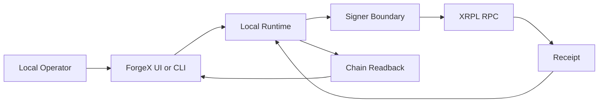

# XRPL Readiness

ForgeX is XRPL EVM-aware, not generic EVM-branded. The runtime and signer envelopes encode XRPL-specific assumptions instead of leaving them implicit.

## XRPL EVM Assumptions

| Item | Current assumption |
| --- | --- |
| Target chain ID | `1449000` by default |
| Default RPC | `https://rpc.testnet.xrplevm.org` |
| Explorer base | `https://explorer.testnet.xrplevm.org` |
| Transaction style in prepared commands | Legacy transaction flags are included in deploy/write command envelopes |

## Operator To Chain Flow

## Chain ID Enforcement

- Every deploy/write preflight calls `eth_chainId`.
- The returned chain ID must match the configured XRPL chain ID.
- If it does not match, the run fails before submission.
- Caller-supplied production RPC overrides are not part of the active runtime.

Current proof status: implementation present, dedicated negative-path capture pending.

## RPC Policy

- RPC is configured by environment, not by caller payload.
- The active runtime treats RPC as a configured infrastructure dependency.
- RPC correctness is validated at run time through chain ID preflight.
- RPC retries are bounded and actionable errors tell the operator how to recover.

## Receipt And Finality Model

- ForgeX treats receipt presence as the minimum requirement for deploy/write success in non-test mode.
- ForgeX does not claim protocol-level economic finality beyond what the configured XRPL EVM RPC and receipt path provide.
- Final displayed write state is based on post-receipt chain readback.
- `prepared` and `submitted` are intermediate states, not success.

## Explorer / Readback Linkage

- Result snapshots include explorer URLs derived from the configured XRPL explorer base.
- Deploy results connect:
  - `forgeRunId`
  - `txHash`
  - contract address
- Write results connect:
  - `forgeRunId`
  - `txHash`
  - post-confirmation `getMessage()` readback

## Network Mismatch Behavior

If the configured RPC is not the expected XRPL EVM network:
1. Preflight fails before submission.
2. The run does not become a successful deploy/write.
3. The operator is told to fix `XRPL_RPC_URL` or `XRPL_CHAIN_ID` and retry.

Current proof status: implementation present, dedicated capture pending.

## Known XRPL-Specific Constraints

- Foundry and RPC behavior must be verified in the operator's actual shell environment.
- Foundry proof is now captured locally, but remaining hostile-path sponsor evidence is still pending.
- XRPL EVM integration is only as strong as the configured RPC and the operator's signer environment.

## Why This Is XRPL-Aware

ForgeX is XRPL-aware because it explicitly bakes XRPL EVM assumptions into:
- chain ID preflight
- default RPC and explorer targets
- deploy/write command envelopes
- receipt/readback reconciliation
- operator guidance and error messaging

It does not rely on generic EVM defaults and then relabel the result as XRPL.
